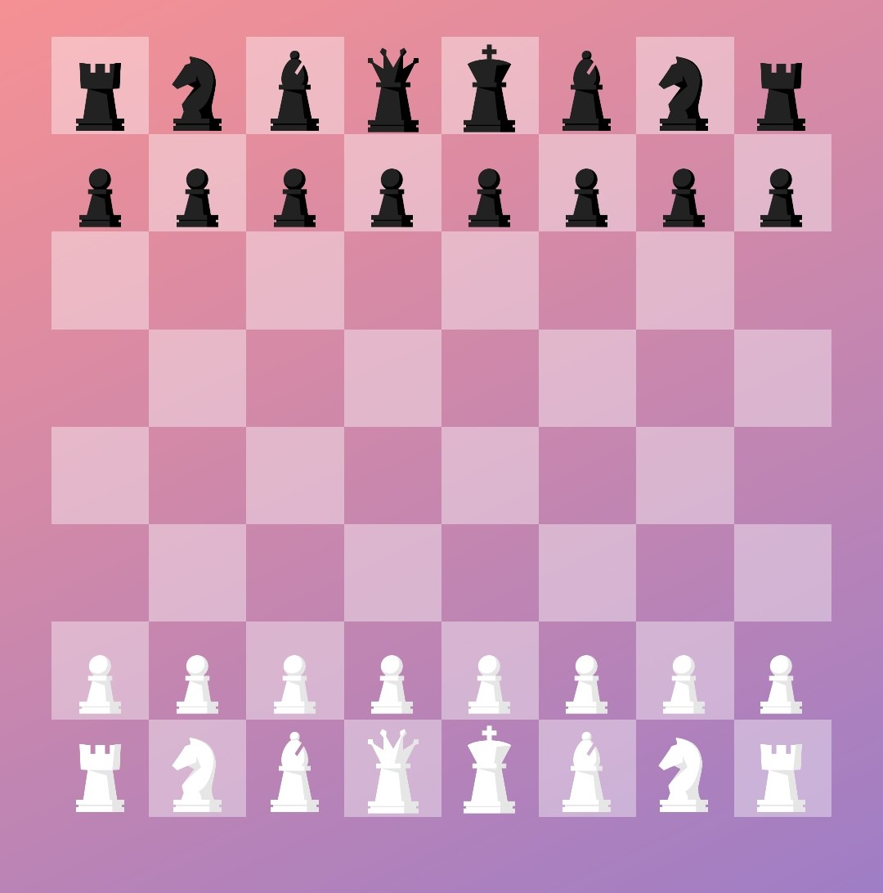
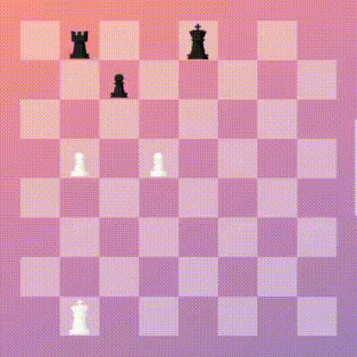
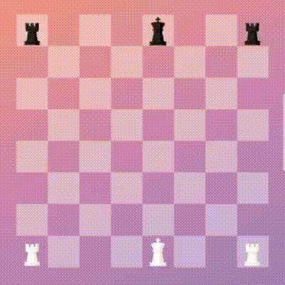

# Chess
 A simple android chess app that follows FIDE standards.
 

I had no idea about this game and I didn't even know the rules. To learn this game, I started coding it, and after a day's research, I made a simple but complete version of this game. The interesting point was that pawn was relatively the most difficult part of implementing the game, because two of the three special moves of the game were related to the pawn, and the pawn's movement and capture were different from the other pieces, so the pawn needed a few more conditions to be able to simulate checkmate.

## Roadmap
- [x] Board
- [x] Pieces
- [x] BoardSimulator
- [x] Check
- [x] En passant
- [x] Castling
  - [x] Kingside
  - [x] Queenside
- [x] Pawn Promotion
- [x] Checkmate
  - [x] Winner
- [x] Draw
  - [x] Stalemate
  - [x] Dead Position
  - [x] Threefold Repetition
  - [x] 50-Move Rule
- [x] Algebraic Notation
- [x] Double Check

## Output

## Promotion
> In chess, promotion is the replacement of a pawn with a new queen, rook, bishop, or knight of the same color. It occurs immediately when the pawn moves to its last rank, with the player choosing the piece of promotion. [Read more](https://en.wikipedia.org/wiki/Promotion_(chess))

## En passant
> The en passant capture is a move in chess. A pawn may capture en passant a horizontally adjacent enemy pawn that has just advanced two squares in one move. The capturing pawn moves to the square that the advancing pawn passed over, as if the advancing pawn had advanced only one square. Such a capture is permitted only on the turn immediately after the two-square advance; it cannot be done on a later turn. The en passant capture is the only capture in chess where the capturing piece does not replace the captured piece on its square. [Read more](https://en.wikipedia.org/wiki/En_passant)

## Castling
> Castling is a move in chess. It consists of moving one’s king two squares toward a rook on the same rank and then moving the rook to the square that the king passed over. Castling is permitted only if neither the king nor the rook has previously moved; the squares between the king and the rook are vacant; and the king does not leave, cross over, or end up on a square attacked by an opposing piece. Castling is the only move in chess in which two pieces are moved at once. [Read more](https://en.wikipedia.org/wiki/Castling)

## References
- [Rules of chess](https://en.wikipedia.org/wiki/Rules_of_chess)
- [Pawn Promotion](https://en.wikipedia.org/wiki/Promotion_(chess))
- [En passant](https://en.wikipedia.org/wiki/En_passant)
- [Castling](https://en.wikipedia.org/wiki/Castling)
- [Algebraic notation](https://en.wikipedia.org/wiki/Algebraic_notation_(chess))
- [Draw (wikipedia.org)](https://en.wikipedia.org/wiki/Draw_(chess))
- [Draw (chess.com)](https://www.chess.com/terms/draw-chess)
- [Stalemate](https://en.wikipedia.org/wiki/Stalemate)
- [Threefold Repetition Rule](https://en.wikipedia.org/wiki/Threefold_repetition)
- [50-Move Rule](https://en.wikipedia.org/wiki/Fifty-move_rule)

License
=======

    Copyright 2022 Amir Hossein Aghajari
    Licensed under the Apache License, Version 2.0 (the "License");
    you may not use this file except in compliance with the License.
    You may obtain a copy of the License at

       http://www.apache.org/licenses/LICENSE-2.0

    Unless required by applicable law or agreed to in writing, software
    distributed under the License is distributed on an "AS IS" BASIS,
    WITHOUT WARRANTIES OR CONDITIONS OF ANY KIND, either express or implied.
    See the License for the specific language governing permissions and
    limitations under the License.

 

  
   <a>Amir Hossein Aghajari</a> • <a href="mailto:amirhossein.aghajari.82@gmail.com">Email</a> • <a href="https://github.com/Aghajari">GitHub</a>

